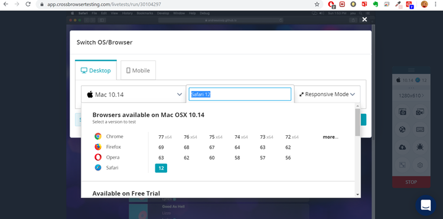

### TESTING
When I have first started the project, I thought I could use the _fetch_ method. After lots of research and two full weeks of trying to make it work through _fetch_ method, I have started asking more people if they could help me. My colleague Sean Murphy told me I should use AJAX instead, because is a better tool for the response Musixmatch is sending back.

I have read all the documentation from Musixmatch website, where they also have a [Playground Area](https://playground.musixmatch.com/#/)  where you can test various parameters and see the response.
My mentor, Simen Daehlin told me about an application called POSTMAN to work with APIs and their responses. I have started using that as well, to see what parameters are allowed and what works, before saving and pushing my work to Github.

During development I have used constantly the console in Google Chrome to check for errors, so I can fix them before I save my work. I have also asked my friends and family to test my site, to see if it loads quick and they get the response they want.

[Esprima: Syntax Validator](https://esprima.org/demo/validate.html) was used to check main.js file for any syntax errors. All code is valid and does not contain any syntax errors.

W3C was used to validate the HTML and CSS code. All code is valid.

I have used  Responsinator to see how the site looks like on different screens. Please see here [Responsinator](andreeaiosip.github.io/what-a-track/](http://www.responsinator.com/?url=https%3A%2F%2Fandreeaiosip.github.io%2Fwhat-a-track%2F). 

I wanted to check how the page looks on different browsers for Windows and iOS, so I have used [crossbrowsertesting.com](https://app.crossbrowsertesting.com/test-center). I have only been able to take screenshots of what test I have performed, because you need to buy a licence to be able to download the results. Please see below the types of test I have performed.

After checking all browsers on mobile and desktop for Windows and iOS, the only issue I have found was the background image was streching a little bit. Thanks to the pattern the background image has, the background is not affected visually very much.
 
 
I have performed various tests on what actions the user might take on the site and the results can be found in this table.

_Interesting bugs:__
I had issue with the background image, which doesn't look the same on all devices. Sometimes it's streches out. I did lots of research and I have tried out a few variations of code, but it didn't fix the problem 100%.
When the modal opens to show the lyrics, the background image does move a little. Again, I have tried many times to fix this, but I couldn't find the bug.
